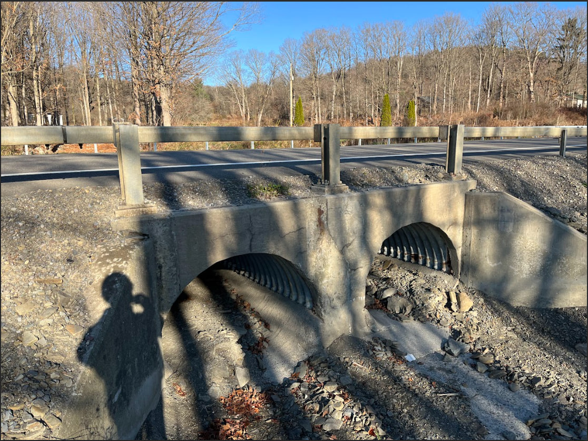

# CRISIS-aversion (Conditional Risk In Stormwater Infrastructure Systems - aversion)

This repository contains the codebase for the research paper:

**Large-scale flood risk analysis of distributed stormwater infrastructure serving 2,300 catchments in New York State**

## Overview

This project examines the spatiotemporal dynamics of flood risk within New York State's road networks, with a focus on the performance and behavior of large culvert drainage systems. It includes data preprocessing, hydrologic and hydraulic modeling, model validation, risk analysis, and visualization workflows used in the study.

<p float="left">
  
  
</p>
<p style="text-align: center; font-style: italic; font-size: 10px;">
  Figure: Field photographs of culverts observed during a site visit to Upstate New York.
</p>

<!--## Website:
The results of this study are visually hosted on 👉 [https://omidemam.github.io/flood_risk_dynamics.github.io/](https://omidemam.github.io/flood_risk_dynamics.github.io/) -->

## Repository Contents

- `Data preprocessing`: Prepares raw data for parallel computation by cleaning, formatting, and organizing it appropriately.
- `Hydrologic model`: Performs watershed delineation, Curve Number (CN) calculation, watershed urbanized portion, and peak hydrologic flow estimation.
- `Hydraulic model`: Calculates the hydraulic capacity of the culverts.
- `Validation`:  Validates each component, including watershed delineation, CN values, peak flow estimations, and hydraulic capacity.
- `Result`: Conducts risk assessment and visualizes both the temporal and spatial dynamics of the risk.

## Data Access

### Input and Output Data

<!--All input and output files required to run the code are hosted on **Zenodo**:

📁 **Zenodo DOI**: [10.5281/zenodo.15306498](https://doi.org/10.5281/zenodo.15306498)

Download and extract the files to the appropriate directories as outlined in the documentation within the repository. -->


## 🗺️ Geospatial Datasets Used

The following datasets were utilized in this study:

| **Dataset Name** | **Reference** | **Usage / Description** |
|------------------|----------------|--------------------------|
| Culvert inventory | NYSDOT (2023) | Culvert identification, geometry, and structural attributes. |
| 1-m and 10-m Digital Elevation Models (DEMs) | USGS (2021) | Watershed delineation and morphological feature extraction. |
| Hydrologic Unit Code 12 (HUC 12) | NYS Department of State (2022) | Parallelization units for delineation and analysis. |
| Streets, Railroads, and Streams | NYS ITS (2023) | Used to identify crossings and refine stream networks. |
| Historical and Projected Precipitation Intensity-Duration-Frequency (IDF) Analyses | NOAA (2015); DeGaetano (2017) | For historical and future extreme precipitation estimation. |
| Historical and Projected Land Cover | Dewitz (2023); Sohl (2018) | For curve number map generation. |
| Hydrologic Soil Group (HSG) | Esri (2022) | For CN map derivation. |
| Curve Number Map Product | Jaafar (2019) | Used for inter-product comparison. |
| USGS Discharge Gages | Hodson (2023) | For validating watershed delineation and discharge computations. |

For detailed dataset descriptions, see **Table 1, Section 1** of the supplementary material.

---

📁 **Figshare DOI**: *Will be added after the paper publication*  

## Getting Started

To run the analysis:

1. Clone the repository:
   ```bash
   git clone https:https://github.com/omidemam/flood_risk_dynamics.git
   cd flood_risk_dynamics

## 📬 Contact

For questions, feedback, or collaboration opportunities, please email me at: [omid.emamjomehzadeh@nyu.edu](mailto:omid.emamjomehzadeh@nyu.edu)


   
## 📚 Citation

If you use this repository in your research or projects, please cite it as follows:

BibTeX format:

```bibtex
@misc{emamjomehzadehandWani(2025),
  author       = {Omid Emamjomehzadeh, Omar Wani},
  title        = {Large-scale flood risk analysis of distributed stormwater infrastructure serving 2,300 catchments in New York State},
  year         = {2025},
  publisher    = {Nature},
  journal      = {Nature communications},
  howpublished = {\url{https://github.com/omidemam/flood_risk_dynamics}},
}
