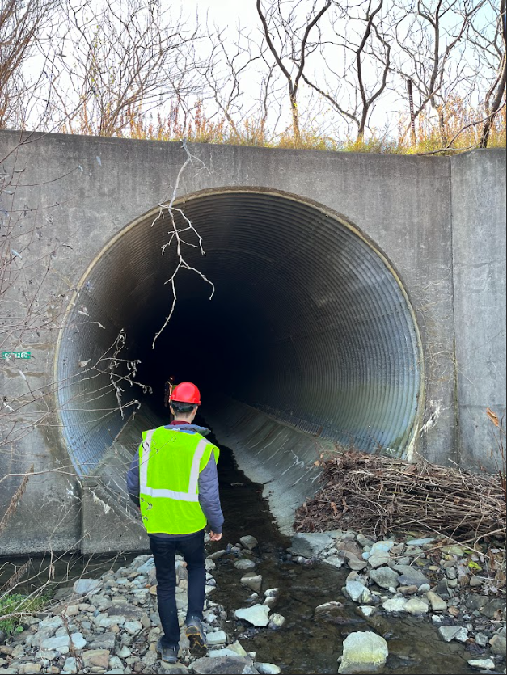

# Flood Risk Dynamics

This repository contains the codebase for the research paper:

**Large-scale flood risk analysis of culvert infrastructure serving 3000 catchments in New York State**

## Overview

This project investigates the spatio-temporal dynamics of flood risk within New York state road networks, focusing on the performance and behavior of large culvert drainage systems. It includes data preprocessing, hydrologic and hydraulic modeling, model validation, risk analysis, and visualization workflows used in the study.

Some images of culverts from a field trip to upstate New York:





## Website:
The results of this study are visually hosted on this website :

## Repository Contents

- `Data preprocessing`:
- `Watershed delineation`:
- `Hydrologic model`: 
- `Hydraulic model`: 
- `Validation`:  
- `Result`:

## Data Access

### Input and Output Data

All input and output files required to run the code are hosted on **Zenodo**:

📁 **Zenodo DOI**: [10.5281/zenodo.15306498](https://doi.org/10.5281/zenodo.15306498)

Download and extract the files to the appropriate directories as outlined in the documentation within the repository.

📁 **Figshare DOI**: *To be added*  
_Replace this line with the actual link or DOI once available._

## Getting Started

To run the analysis:

1. Clone the repository:
   ```bash
   git clone https:https://github.com/omidemam/flood_risk_dynamics.git
   cd flood_risk_dynamics
